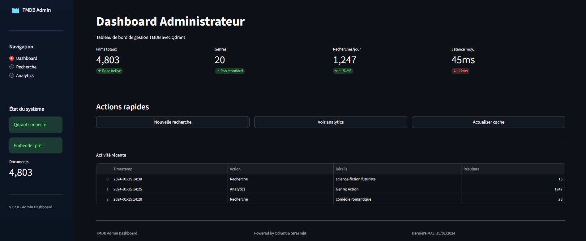
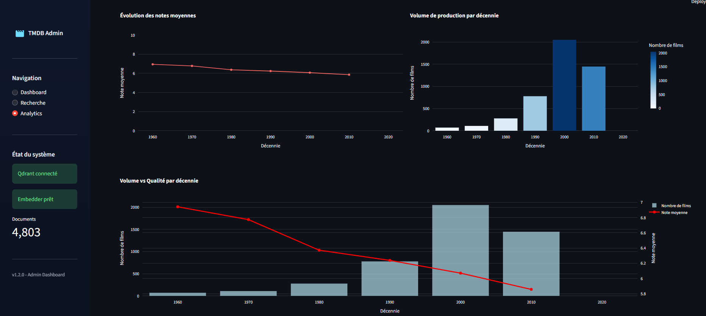
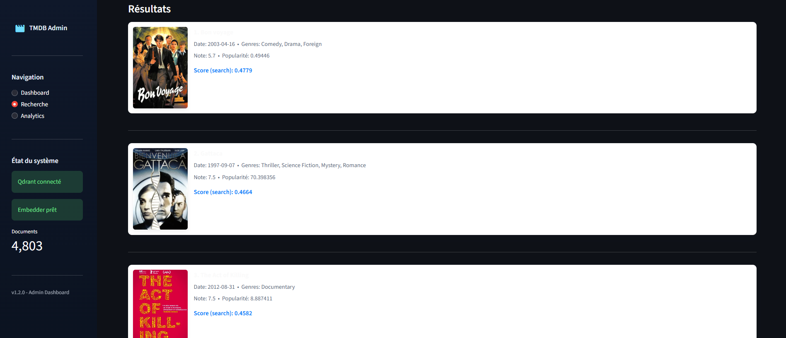

# Projet Big Data & NoSQL — Qdrant + TMDB

## Équipe
- KIDIMBA Miguel (rôle : backend, intégration Qdrant, support)
- Moussa BAKAYOKO (rôle : collecte dataset + nettoyage, WebApp & visualisation)
- TATA Kevin (rôle : gestion de projet)

## Objectif
Mettre en place une base NoSQL vectorielle avec **Qdrant** pour stocker et interroger des films issus du dataset **TMDB**.  
Fonctionnalités principales :
- Import et vectorisation des films (embeddings `sentence-transformers`)
- Recherche sémantique dans Qdrant
- WebApp **Streamlit** pour la démo (recherche + analytics)
- Visualisation des résultats (genres, décennies, top films récents, etc.)

---

## ⚙️ Comment lancer les scripts

### 1. Cloner le projet
```bash
git clone https://github.com/KiddMiguel/Projet-IPSSI-NoSql.git
cd Projet-IPSSI-NoSql
````

### 2. Créer un environnement virtuel

```bash
python -m venv venv
source venv/bin/activate   # Linux / macOS
.\venv\Scripts\Activate    # Windows PowerShell
```

### 3. Installer les dépendances

```bash
pip install -r requirements.txt
```

### 4. Configurer les variables d’environnement

Créer un fichier `.env` à la racine du projet :

```env
QDRANT_URL=https://<votre-cluster>.cloud.qdrant.io
QDRANT_API_KEY=<votre-cle-api>
COLLECTION_NAME=tmdb_movies
TMDB_API_KEY=<votre-cle-tmdb>
```

### 5. Lancer la WebApp

```bash
streamlit run app.py
```

👉 L’app s’ouvre sur [http://localhost:8501](http://localhost:8501).

---

## 📌 Gestion de projet

Nous avons utilisé **Trello** pour organiser les tâches (à faire / en cours / fait) et suivre l’avancement.

🔗 **Lien Trello** : https://trello.com/invite/b/68d4ff869f4e5c931de01beb/ATTI431e7e3f75f8accfb93d3fba90148162459E49EE/projet-final

---

## 📊 Support de présentation

Nous avons synthétisé les résultats et les démonstrations dans un **Google Slides** destiné à un manager non technique.

🔗 **Lien Google Slides** : [https://docs.google.com/presentation/d/1cY8LI4dFB9DNL72DNo2yJ8BbpwqxkqsyJBeAYUxW9WA/edit?usp=sharing](https://docs.google.com/presentation/d/155quvj6LMZ3OKza6gwa0Sf4qk_NFP-dNyewpxeySykQ/edit?usp=sharing)

---

## 📈 Résultats principaux

* Recherche sémantique performante avec filtres par genre et par année.
* Comptage des films par genre et évolution des notes par décennie.
* Top 10 des films récents selon Qdrant.
* Affichage des affiches de films via l’API TMDB.

---

## 🎬 Médias (vidéo et images)

Vous pouvez intégrer directement des vidéos et des images dans le README en HTML. Exemples ci‑dessous — adaptez les chemins (relatifs) ou utilisez des URLs distantes.

- Lecture :
<video controls width="720" poster="./Reccord Kevin et 1 autreEnregistrement- Trim.mp4">
  <source src="./Reccord Kevin et 1 autreEnregistrement- Trim.mp4" type="video/mp4">
  Votre navigateur ne prend pas en charge la vidéo HTML5. <a href="docs/media/demo.mp4">Télécharger la vidéo</a>.
</video>

- DashBoard :


- Analytique :
  

- Recherche
  


